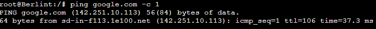

# Jarkom-Modul-3-F09-2022

## Anggota Kelompok

<table>
    <tr>
        <th>NRP</th>
	<th>Nama</th>
    </tr>
    <tr>
        <td>Muhammad Lintang Panjerino</td>
        <td>5025201045</td>
    </tr>
    <tr>
        <td>Sayid Ziyad Ibrahim Alaydrus</td>
	<td>5025201147</td>
    </tr>
    <tr>
        <td>Wahyu Tri Saputro</td>
	<td>5025201217</td>
    </tr>
<table>

## NO 1 & 2

### Loid bersama Franky berencana membuat peta tersebut dengan kriteria WISE sebagai DNS Server, Westalis sebagai DHCP Server, Berlint sebagai Proxy Server, dan Ostania sebagai DHCP Relay

### **Jawab :**

Pertama kita membuat topologi seperti pada soal :


Kemudian, edit network configuration Ostania dengan mengubah script menjadi :

```
auto eth0
iface eth0 inet dhcp

auto eth1
iface eth1 inet static
	address 10.33.1.1
	netmask 255.255.255.0

auto eth2
	iface eth2 inet static
	address 10.33.2.1
	netmask 255.255.255.0

auto eth3
	iface eth3 inet static
	address 10.33.3.1
	netmask 255.255.255.0
```

Setelah mengedit network configuration Ostania, selanjutnya tinggal mengedit network configuration node yang lainnya dengan mengubah script menjadi :

WISE

```
auto eth0
iface eth0 inet static
	address 10.33.2.2
	netmask 255.255.255.0
	gateway 10.33.2.1
```

Berlint

```
auto eth0
iface eth0 inet static
	address 10.33.2.3
	netmask 255.255.255.0
	gateway 10.33.2.1
```

Westalis

```
auto eth0
iface eth0 inet static
	address 10.33.2.4
	netmask 255.255.255.0
	gateway 10.33.2.1
```

Eden

```
auto eth0
iface eth0 inet static
	address 10.33.3.2
	netmask 255.255.255.0
	gateway 10.33.3.1
```

NewstonCastle

```
auto eth0
iface eth0 inet static
	address 10.33.3.3
	netmask 255.255.255.0
	gateway 10.33.3.1
```

KemonoPark

```
auto eth0
iface eth0 inet static
	address 10.33.3.4
	netmask 255.255.255.0
	gateway 10.33.3.1
```

SSS

```
auto eth0
iface eth0 inet static
	address 10.33.1.2
	netmask 255.255.255.0
	gateway 10.33.1.1
```

Garden

```
auto eth0
iface eth0 inet static
	address 10.33.1.3
	netmask 255.255.255.0
	gateway 10.33.1.1
```

Setelah semua node sudah diedit network configurationnya, sekarang kita akan menjadikan WISE sebagai DNS Server dengan cara menginstall bind9.

```
apt-get update
apt-get install bind9 -y
```

Kemudian bisa kita ping ke google.com untuk mengecek apakah sudah tersambung ke internet atau belum.

Selanjutnya, kita buat Westalis menjadi DHCP Server dengan cara install ISC-DHCP-SERVER.

```
apt-get update
apt-get install isc-dhcp-server -y
```

Kemudian edit file konfigurasi pada `/etc/default/isc-dhcp-server`. Lalu tambahkan baris `INTERFACE="eth0"` di dalamnya. Kemudian bisa di ping ke google.com

Selanjutnya adalah menjadikan Berlint sebagai Proxy Server dengan cara menginstall squid.

```
apt-get update
apt-get install squid -y
```

Kemudian bisa di ping ke google.com


Terakhir adalah menjadikan Ostania sebagai DHCP Relay dengan cara menginstall ISC-DHCP-RELAY.

```
apt-get update
apt-get install isc-dhcp-relay -y
```

Kemudian edit file konfigurasi pada `/etc/default/isc-dhcp-relay`. Lalu tambahkan baris `10.33.2.4` dan `INTERFACES="eth1 eth2 eth3"` di dalamnya, kemudian restart service `service isc-dhcp-relay restart`.


## NO 3

### Client yang melalui Switch1 mendapatkan range IP dari [prefix IP].1.50 - [prefix IP].1.88 dan [prefix IP].1.120 - [prefix IP].1.155.

### **Jawab :**

Edit file konfigurasi Westalis pada `/etc/dhcp/dhcpd.conf`. Lalu tambahkan script seperti berikut :

```
subnet 10.33.1.0 netmask 255.255.255.0 {
	range 10.33.1.50 10.33.1.88;
	range 10.33.1.120 10.33.1.155;
	option routers 10.33.1.1;
	option broadcast-address 10.33.1.255;
	option domain-name-servers 10.33.2.2;
	default-lease-time 300;
	max-lease-time 6900;
}
```

Setelah itu, restart sevice dengan perintah `service isc-dhcp-server restart`. Setelah direstart, cek status apakah dhcp server berjalan atau tidak dengan perintah `service isc-dhcp-server status`
Selanjutnya edit konfigurasi `/etc/network/interfaces` pada SSS dan Garden. Tambahkan baris berikut di dalamnya :

```
auto eth0
iface eth0 inet dhcp
```

Selanjutnya testing menggunakan perintah `ip a`, jika berhasil maka hasilnya akan seperti berikut :


## NO 4

### Client yang melalui Switch3 mendapatkan range IP dari [prefix IP].3.10 - [prefix IP].3.30 dan [prefix IP].3.60 - [prefix IP].3.85.

### **Jawab :**

Kurang lebih sama seperti nomor 3, Edit file konfigurasi Westalis pada `/etc/dhcp/dhcpd.conf`. Lalu tambahkan script seperti berikut :

```
subnet 10.33.1.0 netmask 255.255.255.0 {
	range 10.33.3.10 10.33.3.30;
	range 10.33.3.50 10.33.3.85;
	option routers 10.33.3.1;
	option broadcast-address 10.33.3.255;
	option domain-name-servers 10.33.2.2;
	default-lease-time 600;
	max-lease-time 6900;
}
```

Setelah itu, restart sevice dengan perintah `service isc-dhcp-server restart`. Setelah direstart, cek status apakah dhcp server berjalan atau tidak dengan perintah `service isc-dhcp-server status`
Selanjutnya edit konfigurasi `/etc/network/interfaces` pada Eden, NewstonCastle, dan KemonoPark. Tambahkan baris berikut di dalamnya :

```
auto eth0
iface eth0 inet dhcp
```

Selanjutnya testing menggunakan perintah `ip a`, jika berhasil maka hasilnya akan seperti berikut :


## NO 8

### SSS, Garden, dan Eden digunakan sebagai client Proxy agar pertukaran informasi dapat terjamin keamanannya, juga untuk mencegah kebocoran data.

### **Jawab :**

#### I. Konfigurasi pada SSS, Garden, dan Eden

Untuk menjadikan SSS, Garden, dan Eden sebagai client Proxy, maka akan dilakukan pengaktifan proxy pada masing-masing client.

```
export http_proxy="http://10.33.2.3:9009"
```

10.33.2.3 adalah IP dari Proxy Server dan 9009 adalah port yang digunakan.

#### II. Testing

Lakukan pengecekan dengan cara mencari apakah sudah ada proxy pada client proxy.

```
env | grep -i proxy
```


## NO 9 & 10

### Pada Proxy Server di Berlint, Loid berencana untuk mengatur bagaimana Client dapat mengakses internet. Artinya setiap client harus menggunakan Berlint sebagai HTTP & HTTPS proxy. Adapun kriteria pengaturannya adalah sebagai berikut:

<br>

### 1. Client hanya dapat mengakses internet diluar (selain) hari & jam kerja (senin-jumat 08.00 - 17.00) dan hari libur (dapat mengakses 24 jam penuh)

### 2. Adapun pada hari dan jam kerja sesuai nomor (1), client hanya dapat mengakses domain loid-work.com dan franky-work.com (IP tujuan domain dibebaskan)

### **Jawab :**

#### I. Penjelasan

Sesuai aturan, client tidak bisa mengakses internet pada Weekday 08.00-17.00. Mereka hanya bisa mengakses internet pada Weekday 00.00-07.59, Weekday 17.01-23.59, dan Weekend 00.00-23.59. Sala satu cara yang dapat dilakukan untuk mengetes hal ini adalah dengan lynx ke google.com: `lynx google.com`.

Kemudian, pada Weekday 08.00-17.00 mereka hanya bisa mengakses domain loid-work.com dan franky-work.com , dan pada waktu selain itu domain loid-work.com dan franky-work.com tidak bisa diakses.

Pada saat testing, untuk mengatur waktu dapat dengan menggunakan command _date -s_ seperti berikut:

```
date -s "DD MMM YYYY HH:MM:SS"
```

sehingga menjadi:

```
date -s "14 NOV 2022 10:00:00"
date -s "14 NOV 2022 20:00:00"
date -s "19 NOV 2022 10:00:00"
```

#### II. Testing Weekday 08.00-17.00


Seperti pada gambar-gambar di atas, terbukti bahwa pada Weekday 08.00-17.00, client tidak bisa mengakses internet kecuali ke domain loid-work.com dan franky-work.com

#### III. Testing Weekday 00.00-07.59 dan Weekday 17.01-23.59


Seperti pada gambar-gambar di atas, terbukti bahwa pada Weekday 00.00-07.59 dan Weekday 17.01-23.59, client bisa mengakses internet kecuali ke domain loid-work.com dan franky-work.com

#### IV. Testing Weekend 00.00-23.59


Seperti pada gambar-gambar di atas, terbukti bahwa pada Weekend 00.00-23.59, client bisa mengakses internet kecuali ke domain loid-work.com dan franky-work.com

## NO 12 & 13

### Pada Proxy Server di Berlint, Loid berencana untuk mengatur bagaimana Client dapat mengakses internet. Artinya setiap client harus menggunakan Berlint sebagai HTTP & HTTPS proxy. Adapun kriteria pengaturannya adalah sebagai berikut:

<br>

### 4. Agar menghemat penggunaan, akses internet dibatasi dengan kecepatan maksimum 128 Kbps pada setiap host (Kbps = kilobit per second; lakukan pengecekan pada tiap host, ketika 2 host akses internet pada saat bersamaan, keduanya mendapatkan speed maksimal yaitu 128 Kbps)

### 5. Setelah diterapkan, ternyata peraturan nomor (4) mengganggu produktifitas saat hari kerja, dengan demikian pembatasan kecepatan hanya diberlakukan untuk pengaksesan internet pada hari libur

### **Jawab :**

#### I. Penjelasan

Pembatasan bandwith kepada client dapat dilakukan dengan mengatur konfigurasi pada file **/etc/squid/squid.conf**. Berikut adalah konfigurasinya:

```
delay_pools 1
delay_class 1 2
delay_access 1 allow weekend_available
delay_parameters 1 none 16000/16000
delay_access 1 deny all
```

Setelah melakukan konfigurasi, restart squid

```
service squid restart
```

Pada `delay_access` diterapkan 2 aturan yaitu yang pertama `delay_access 1 allow weekend_available` dan yang kedua `delay_access 1 deny all`. Pada aturan pertama artinya adalah membatasi akses hanya pada variabel _weekend_available_ di mana variabel ini di-include dari file **/etc/squid/acl.conf**, yaitu pada **Weekend 00.00-23.59**. Pada aturan kedua artinya adalah tidak membatasi akses internet selain pada aturan pertama. Command `delay_parameters 1 none 16000/16000` menunjukkan bahwa akses internet dibatasi maksimum 128 Kbps pada tiap host.

#### II. Testing

Untuk testing kecepatan internet dapat dilakukan dengan menggunakan **speedtest pada CLI**. Caranya adalah:

- Matikan proxy: `unset http_proxy`
- Lakukan update `apt-get update` dan install speedtest pada cli `apt install speedtest-cli`
- Jalankan script `export PYTHONHTTPSVERIFY=0` untuk menonaktifkan verifikasi certificate pada saat menjalankan script Python
- Eksekusi speed test dengan perintah `speedtest`


Pada gambar pertama terbukti bahwa pada **Weekday 00.00-07.59 dan Weekday 17.01-23.59** akses internet client tidak dibatasi.

Pada gambar kedua terbukti bahwa pada **Weekend 00.00-23.59** akses internet client dibatasi.

Pada gambar ketiga terbukti bahwa pada **Weekday 08.00-17.00** client tidak dapat mengakses internet.
